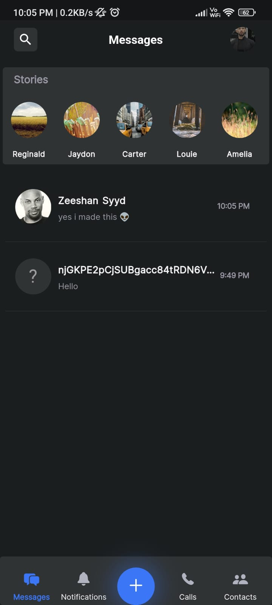
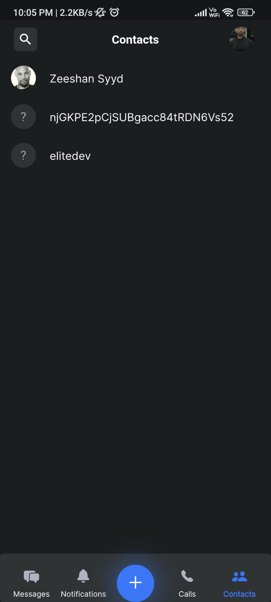
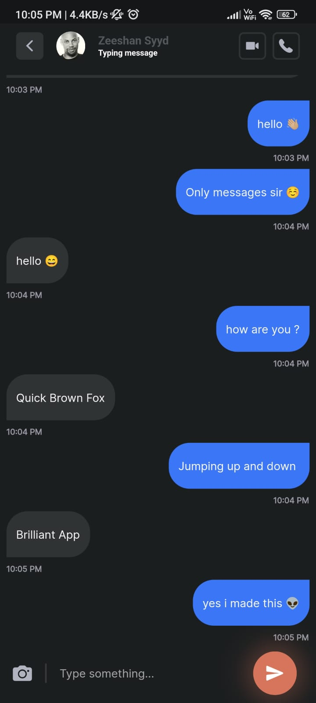
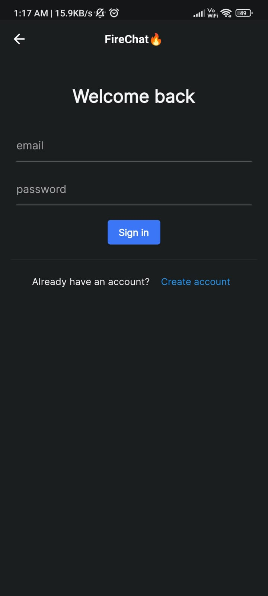
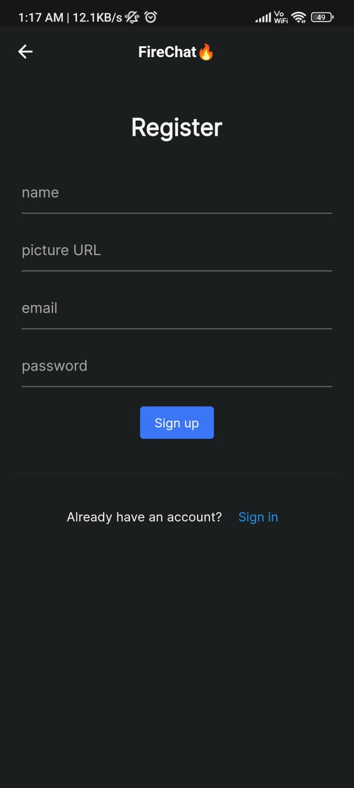

# Firechat🔥

A new Flutter project.

## Getting Started

Flutter based chat application using flutter & firebase and stream api.

## Libraries used

- cupertino_icons: ^1.0.2
- google_fonts: ^3.0.1
- cached_network_image: ^3.2.1
- faker: ^2.0.0
- jiffy: ^5.0.0
- stream_chat_flutter_core: ^4.5.0
- logger: ^1.1.0
- firebase_core: ^1.23.0
- firebase_auth: ^3.10.0
- cloud_functions: ^3.3.8

## Snapshots

